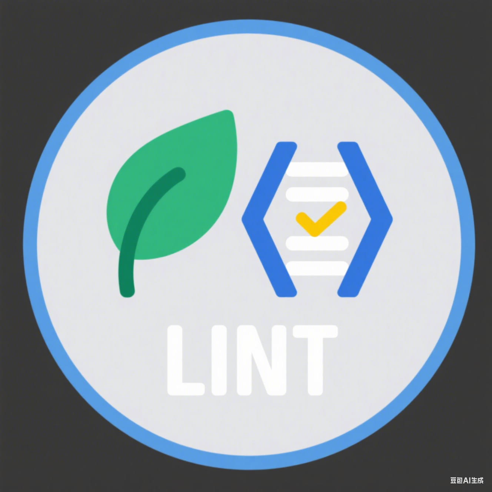

# @hhfe/vue3-lint-config

<p align="center">
  
</p>

<p align="center">
  <a href="https://www.npmjs.com/package/@hhfe/vue3-lint-config"></a>
  <a href="https://www.npmjs.com/package/@hhfe/vue3-lint-config"></a>
  <a href="https://github.com/lorainwings/vue3-lint-config/blob/master/LICENSE"></a>
  
  
  
  
  
  
  
  
  
  
</p>

> **一站式前端代码质量解决方案，集成 ESLint、Stylelint、Prettier、Commitlint、Lint-staged，专为 Vue3/TypeScript 项目设计，灵活、专业、可扩展。**

---

## ✨ 特性亮点

- 🚀 **开箱即用**：一行配置，集成多工具最佳实践
- 🎨 **全方位格式化**：支持 JS/TS/Vue/样式/Markdown/JSON 等
- 🛡️ **严格规范**：基于业界主流规则，兼容团队自定义
- 🧩 **高度可扩展**：支持独立/组合/链式调用，适配多场景
- 🛠️ **现代架构**：基于 ESLint Flat Config，支持最新生态
- 📦 **Monorepo 友好**：适配多包管理与多项目结构
- 📝 **完善提交规范**：内置 Conventional Commits 支持
- ⚡ **极速体验**：极致性能，自动检测依赖与环境

---

## 🚀 安装与快速开始

### 1. 安装依赖

```bash
pnpm add -D @hhfe/vue3-lint-config eslint stylelint prettier @commitlint/cli lint-staged
```

### 2. 快速集成（推荐）

在项目根目录新建 `lint.config.js`：

```js
import { defineLintConfig } from '@hhfe/vue3-lint-config'

export default defineLintConfig({
  eslint: true,
  stylelint: true,
  prettier: true,
  commitlint: true,
  lintStaged: true,
})
```

### 3. 独立工具配置（按需引入）

- `eslint.config.js`
- `stylelint.config.js`
- `prettier.config.js`
- `commitlint.config.js`
- `lint-staged.config.js`

详见 [examples/](./examples) 目录。

---

## 🧑‍💻 用法详解

### 1. 独立配置

```js
// eslint.config.js
import { defineEslintConfig } from '@hhfe/vue3-lint-config/eslint'
export default defineEslintConfig({
  rules: { 'no-console': 'warn' },
})
```

### 2. 组合配置

```js
import { defineLintConfig } from '@hhfe/vue3-lint-config'
export default defineLintConfig({
  eslint: { vue: true, typescript: true },
  stylelint: { scss: true, prettier: true },
  prettier: { semi: false },
  commitlint: true,
  lintStaged: true,
})
```

### 3. 高级用法（链式/自定义/覆盖）

```js
import { defineLintConfig } from '@hhfe/vue3-lint-config'
export default defineLintConfig({
  eslint: {
    vue: true,
    typescript: true,
    overrides: {
      'vue/max-attributes-per-line': ['error', { singleline: 3 }],
    },
  },
  stylelint: {
    scss: true,
    overrides: {
      'color-hex-case': 'upper',
    },
  },
  ignores: ['dist/', 'node_modules/'],
})
```

---

## 🖥️ IDE 集成与自动修复

### VS Code

1. 安装 [ESLint 插件](https://marketplace.visualstudio.com/items?itemName=dbaeumer.vscode-eslint)
2. `.vscode/settings.json` 推荐配置：

```json
{
  "eslint.experimental.useFlatConfig": true,
  "prettier.enable": false,
  "editor.formatOnSave": false,
  "editor.codeActionsOnSave": {
    "source.fixAll.eslint": "explicit",
    "source.organizeImports": "never"
  },
  "eslint.validate": [
    "javascript", "typescript", "vue", "json", "yaml", "markdown", "css", "scss", "less"
  ]
}
```

### WebStorm/JetBrains

- 启用 ESLint，选择“自动检测配置”或手动指定 `eslint.config.js`

### 其他编辑器

- 参考 ESLint/Stylelint/Prettier 官方插件配置

---

## ⚙️ 配置项详解

### 支持的配置项（OptionsConfig）

- `eslint`：`boolean | object`，支持 vue/typescript/react/nextjs/svelte/solid/astro/unocss/markdown/yaml/toml/jsonc/jsdoc/jsx/node/test/perfectionist/imports/unicorn/regexp/command/comments/disables/ignores/stylistic/sort/pnpm
- `stylelint`：`boolean | object`，支持 scss/vue/order/prettier
- `prettier`：`boolean | object`，支持 semi/singleQuote/tabWidth/useTabs/trailingComma
- `commitlint`：`boolean | object`，支持 conventional/customRules
- `lintStaged`：`boolean | object`，支持 eslint/stylelint/prettier
- `gitignore`、`autoRenamePlugins`、`componentExts`、`ignores`、`overrides`

详见 [src/types.ts](./src/types.ts) 类型定义。

---

## 🏆 最佳实践

- 推荐分开维护各工具配置，便于团队协作和定制
- Monorepo 场景建议统一管理配置，提升一致性
- 配合 simple-git-hooks/lint-staged 实现自动化代码质量保障
- 充分利用 overrides/ignores 灵活适配项目需求

---

## ❓ 常见问题（FAQ）

- **Q: 如何只用 Prettier/Stylelint/ESLint 某一项？**
  - 只需在配置中传入对应项为 true 或对象参数即可
- **Q: 如何自定义规则？**
  - 通过 rules/overrides/customRules 传递即可，见类型定义
- **Q: 依赖冲突怎么办？**
  - 请确保 peerDependencies 与实际依赖版本一致
- **Q: Flat Config 下 .eslintignore 不生效？**
  - 请使用 `ignores` 配置项
- **Q: 如何在 CI/CD 中集成？**
  - 推荐在 CI 脚本中执行 `pnpm lint`/`pnpm lint:fix` 等命令

---

## 🤝 贡献指南

欢迎任何形式的贡献！

- 提交 Issue 反馈 bug 或建议
- 提交 Pull Request 优化规则或文档
- 参与讨论，共建更专业的前端规范生态

---

## 📦 版本策略

- 遵循 [SemVer](https://semver.org/lang/zh-CN/) 语义化版本管理
- 规则变更/依赖升级视为非破坏性更新，重大架构调整视为 breaking change
- 每次发布均附详细 [CHANGELOG](./CHANGELOG.md)

---

## 📝 许可证

MIT License © HHFE Team
